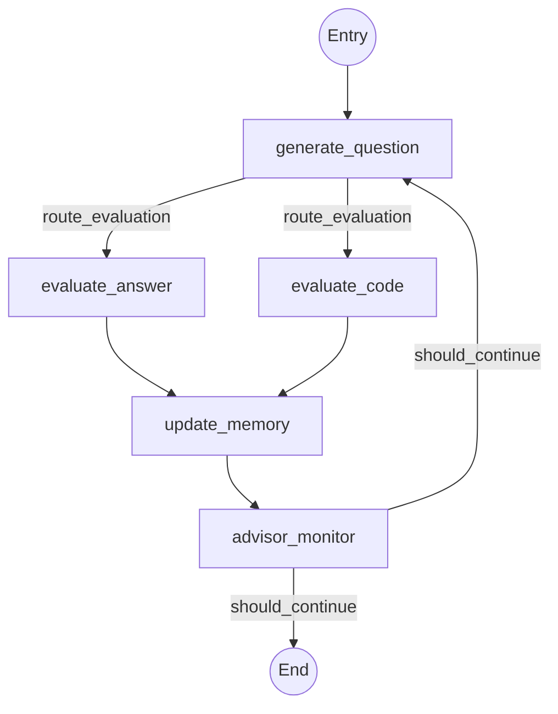

# 🧠 Vedrix Interview Engine Architecture

The **Interview Engine** is the core intelligence of the Vedrix platform. It manages the interview lifecycle, generates adaptive questions, evaluates candidate responses, and provides real-time feedback using a multi-agent orchestration pattern powered by **LangGraph**.

## 🏗️ Core Components

### 1. State Management (`state.py`)
The engine maintains a rich `InterviewState` throughout the session. Key state attributes include:
- **`messages`**: Full conversation history.
- **`current_phase`**: One of `greeting`, `welcome`, `warmup`, `technical`, `stress`, `behavioral`, or `closing`.
- **`covered_skills`**: Tracked list of skills identified during the interview.
- **`is_coding_mode`**: Flag to trigger the technical sandbox.
- **`advisor_ready_to_close`**: AI recommendation for HR to end the interview.

### 2. The Graph Workflow (`graph.py`)
The interview follows a stateful directed acyclic graph (DAG) structure:

### 3. Intelligence Nodes (`nodes.py`)
Each node in the graph is an asynchronous worker responsible for a specific logic:

- **`generate_question_node`**: Uses `QUESTION_GEN` or `DEEP_FOLLOWUP` models to craft the next question based on current phase and pending skills.
- **`evaluate_answer_node`**: Analyzes the candidate's verbal response for accuracy, clarity, and depth.
- **`evaluate_code_node`**: specialized node for analyzing code snippets from the sandbox.
- **`update_memory_node`**: Extracts skills and updates the candidate's profile in the state.
- **`advisor_monitor_node`**: Background observer that calculates when sufficient information has been gathered to make a hiring decision.

## 🚦 Task-Aware Model Routing (`model_router.py`)

Vedrix uses a specialized router to map specific tasks to the most efficient LLMs:

| Task Type | Primary Model | Provider | Key Strength |
|-----------|---------------|----------|--------------|
| **Question Gen** | Llama 3.1 8B | Groq | Speed & Flow |
| **Deep Follow-up**| Llama 3.1 70B | NVIDIA | Reasoning |
| **Answer Eval** | Llama 3.3 70B | Groq | Logic & Accuracy|
| **Code Eval** | Qwen 2.5 Coder | OpenRouter| Programming Logic|
| **Report Gen** | Llama 3.1 70B | NVIDIA | Synthesis |

## 🔄 Real-time Integration

The engine is consumed via WebSockets in `app/api/v1/endpoints/interview.py`. 
- **Streaming**: Uses `interview_graph.astream` to provide incremental updates to the frontend.
- **Interruption**: The graph uses `interrupt_before` to wait for candidate input before proceeding to evaluation nodes.
- **HR Override**: HR instructions can be injected directly into the state, which the `generate_question_node` respects for guided interviewing.

## 🛠️ Extension Guide

To add a new skill category or change interview behavior:
1. Update `TECHNICAL_SKILLS` or `SOFT_SKILLS` in `nodes.py`.
2. Modify `generate_question_node` logic to handle the new category.
3. If adding a new node, register it in `graph.py`.
