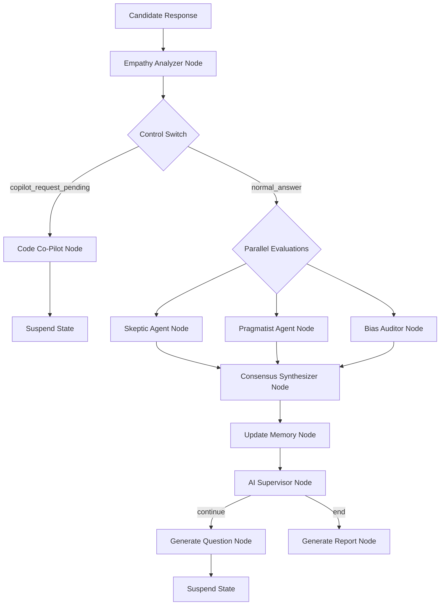

# 🧠 Vedrix Next-Generation Agentic AI Architecture

This document describes the architectural specifications, communication protocols, and execution topology of the next-generation agentic AI features implemented in the Vedrix AI Interview System.

---

## 🏗️ Architectural Topology

The system transitions from a single-agent interviewer script to a **cooperative multi-agent graph** orchestrated via **LangGraph**. The workflow utilizes asynchronous parallel processing, real-time emotional analysis, vector-based episodic memory, and human-in-the-loop state patching.



---

## 🛠️ Feature Modules

### 1. Collaborative Code Co-Pilot (`code_copilot_node`)
- **Purpose:** Assists the candidate during coding tasks without giving away the exact solution.
- **Activation Mode:** Activated *on-demand* (when the candidate requests help using the chat UI) or *proactively* (triggered by the AI Supervisor if multiple compile errors are recorded).
- **Execution Strategy:** Reads the active code snippet and error logs, then formulates a concise, supportive hint of 1–3 sentences highlighting logical or syntactical issues.

### 2. Multi-Agent Debate & Consensus Pattern
- **Purpose:** Eliminates single-LLM evaluation bias and hallucinations.
- **Sub-Agents:**
  - **Skeptic Agent (`skeptic_evaluation_node`):** Audits responses strictly for edge cases, logical fallacies, and conceptual limits.
  - **Pragmatist Agent (`pragmatist_evaluation_node`):** Audits answers for readability, performance bottlenecks, and real-world applicability.
  - **Bias Auditor (`bias_auditor_node`):** Audits content solely for core understanding, removing styling, typos, accents, or fluency deficits from the grade calculation.
- **Consensus Synthesizer (`consensus_synthesizer_node`):** Receives the intermediate text reports from the parallel agents and uses a stronger reasoning model (e.g., Llama 3.3 70B) to compile the final JSON `EvaluationSchema`.

### 3. Empathy-Driven Adaptive Behavior (`empathy_analyzer_node`)
- **Purpose:** Detects candidate anxiety, stress, or fatigue and dynamically recalibrates the interview style.
- **Operation:** Evaluates answer lengths, hesitation markers (e.g., *um, uh, like*), and pacing.
- **Graph Updates:** If the stress rating exceeds 7.0/10.0, the graph automatically toggles the difficulty to `easy` and instructs the `generate_question_node` to adopt a warm, highly supportive conversational tone.

### 4. Episodic RAG Memory (`rag_service`)
- **Purpose:** Tailors questions dynamically to a candidate's actual projects, repos, and history.
- **Storage Database:** Utilizes a lightweight, persistent **ChromaDB** collection (`app/db/chroma`) to host embeddings.
- **Indexing Pipeline:** On session startup, the system indexes the resume and fetches metadata from the candidate's public GitHub repositories.
- **Query Strategy:** On every conversational turn, the candidate's response is embedded to retrieve matching context chunks, which are injected into the interviewer node's prompt.

### 5. HR Whispering & State Patching
- **Purpose:** Enables recruiters to override the AI interviewer live.
- **Protocol:** Uses an asynchronous WebSocket event `type: "hr_whisper"`.
- **Implementation:** The endpoint intercepts the event and directly patches the LangGraph thread state with `hr_whisper_instructions` without restarting execution. The AI interviewer acknowledges and acts on the instructions in the immediate next turn.

---

## 📡 WebSocket Protocols & Payloads

### 1. Recruiter Live Whisper (Recruiter ➔ Server)
```json
{
  "type": "hr_whisper",
  "data": "We have covered FastAPI. Ask them about relational database normalization next."
}
```

### 2. Summon Code Co-Pilot (Candidate ➔ Server)
```json
{
  "type": "copilot_request",
  "data": "def find_sum(arr):\n    # Stuck on recursive step\n    return find_sum(arr)"
}
```

### 3. Server Co-Pilot Response (Server ➔ Candidate)
```json
{
  "type": "copilot_update",
  "data": {
    "timestamp": "2026-05-23T17:31:09.123Z",
    "hint": "I notice your function is calling itself recursively without checking for a base case. Have you thought about what should happen when the array is empty?",
    "trigger": "manual_request"
  }
}
```
