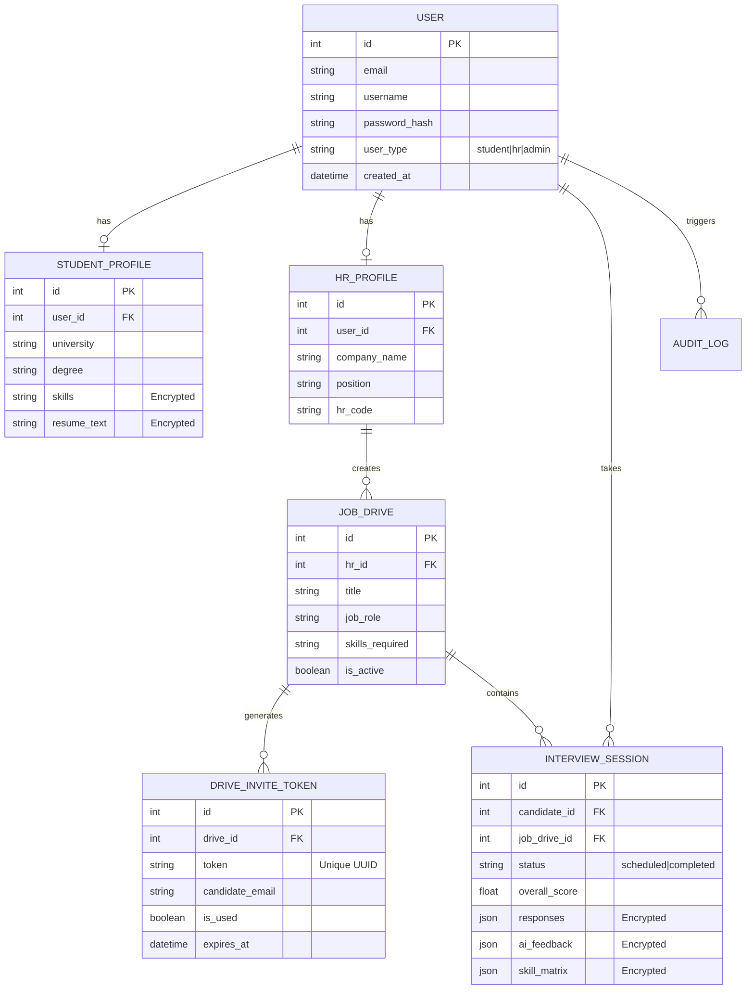

# 🗄️ Database Design & Entity Relationship

**Project:** Vedrix AI Interview System  
**Version:** 1.0.0

## 1. Entity Relationship Diagram (ERD)

## 2. Security & Encryption Policy
Vedrix implements a tiered data protection strategy:

- **PII Protection:** Student names, emails, and phone numbers are stored in plain text for fast lookup but are guarded by strict RBAC.
- **Sensitive Content:** `responses`, `resume_text`, and `ai_feedback` are stored as `EncryptedString` or `EncryptedJSON` using AES-128 (Fernet).
- **Password Safety:** Hashed using `bcrypt` with a minimum work factor of 12.

## 3. Indexing Strategy
To ensure performance under load (100+ concurrent sessions), the following indexes are maintained:

| Table | Index Columns | Purpose |
|-------|---------------|---------|
| `user` | `email`, `username` | Fast login/lookup. |
| `interview_session` | `candidate_id`, `job_drive_id`, `status` | Dashboard filtering. |
| `drive_invite_token` | `token`, `drive_id` | Fast magic link validation. |
| `audit_log` | `user_id`, `created_at` | Rapid forensic analysis. |

## 4. Scalability Note
While the system supports **SQLite** for zero-config local development, it is architected for **PostgreSQL**. All relationships use standard foreign key constraints, and the schema is optimized for asynchronous concurrent access via `asyncpg`.
