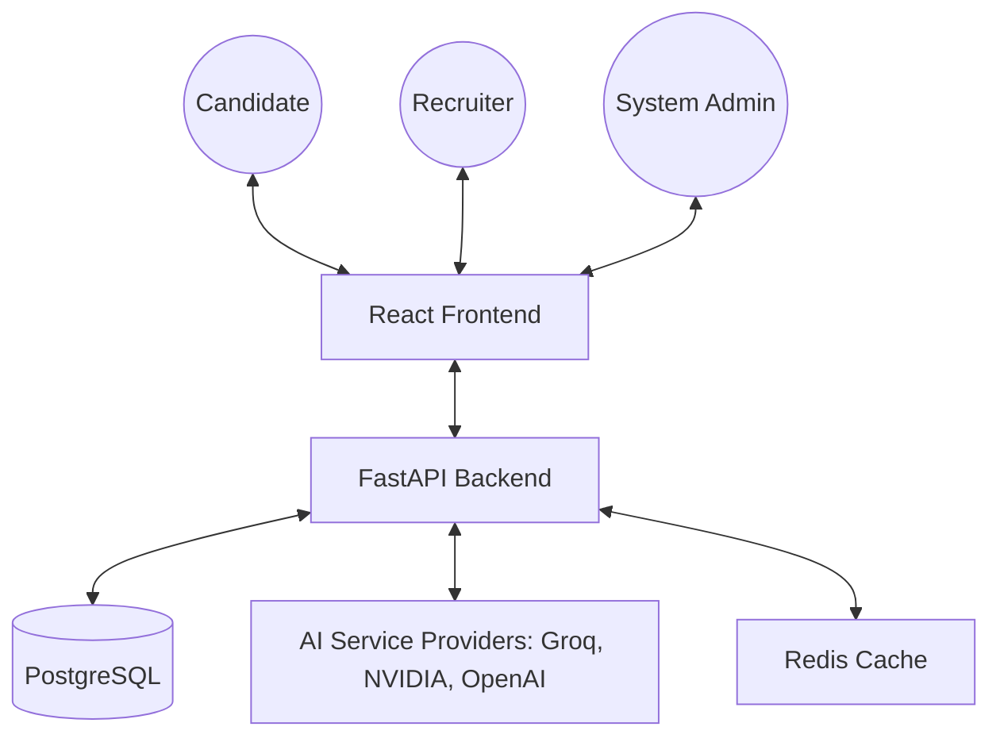
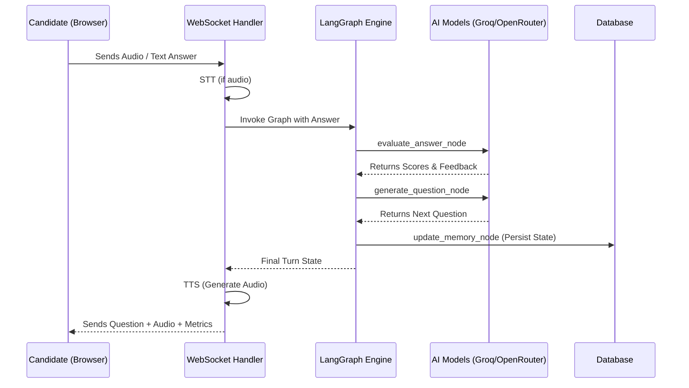
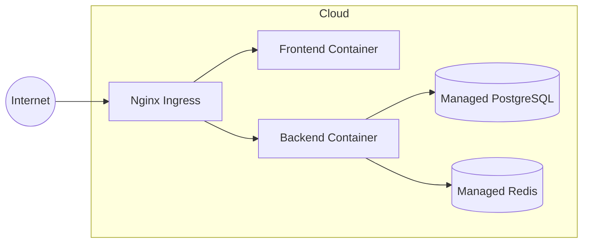

# 🏗️ Software Architecture Document (SWADS)

**Project:** Vedrix AI Interview System  
**Version:** 1.0.0

## 1. System Context Diagram
The following diagram illustrates how Vedrix interacts with external entities and users.

## 2. Layered Architecture
Vedrix follows a clean, decoupled architecture:

### 2.1 Presentation Layer (Frontend)
- **Framework:** React 19 (Vite) + TypeScript.
- **State Management:** Zustand (Global) + React Query (Server Sync).
- **Communication:** Axios (REST) + WebSockets (Live Interview).

### 2.2 Application Layer (Backend API)
- **Framework:** FastAPI (Asynchronous).
- **Security:** JWT Auth (HTTP-only cookies) + CSRF Protection.
- **Task Routing:** Specialized Model Router for cost/performance optimization.

### 2.3 Logic Layer (Services)
- **Orchestration:** LangGraph (Stateful multi-agent workflows).
- **AI Services:** 
    - **STT:** Groq (Whisper Large V3).
    - **TTS:** OpenAI (TTS-1).
    - **Reasoning:** NVIDIA (Llama 3.1 70B).
    - **Evaluation:** Groq (Llama 3.3 70B).

### 2.4 Data Persistence Layer
- **ORM:** SQLModel (SQLAlchemy).
- **Primary DB:** PostgreSQL (Production) / SQLite (Development).
- **Migrations:** Alembic.

## 3. High-Level Logic Flow (SOCME)
This sequence diagram shows the interaction during a typical interview turn.

## 4. Deployment Architecture
The system is containerized and ready for cloud orchestration.

## 5. Security Architecture
- **Stateless Authentication:** JWT issued via cookies with `httponly`, `secure`, and `samesite` flags.
- **Encryption:** Transcripts and PII are encrypted at rest using Fernet (AES-128).
- **Rate Limiting:** Implemented via `SlowAPI` on sensitive endpoints (Auth, AI).
