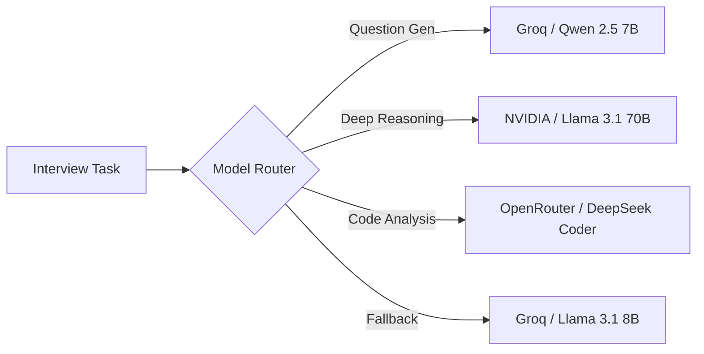

# 🧩 Software Component Design (SWCDS)

**Project:** Vedrix AI Interview System  
**Version:** 1.0.0

## 1. Interview Engine Component
The Interview Engine is a stateful orchestration of multiple specialized AI nodes.

### 1.1 State Schema (`InterviewState`)
| Key | Type | Description |
|-----|------|-------------|
| `messages` | `List[Dict]` | Sequential conversation history. |
| `current_phase` | `Literal` | Phase tracking (greeting, technical, etc.). |
| `covered_skills` | `List[str]` | Skills identified in the interview so far. |
| `advisor_ready_to_close` | `bool` | Flag indicating readiness to conclude. |

### 1.2 Graph Nodes
- **`generate_question`**: Crafts the next inquiry based on the phase and skill coverage.
- **`evaluate_answer`**: Computes granular scores (0-10) for the previous response.
- **`evaluate_code`**: (Conditional) Analyzes technical submissions in the coding sandbox.
- **`update_memory`**: Persists extracted skills and updates the candidate's profile.
- **`advisor_monitor`**: Independent evaluator checking for information saturation.

## 2. Model Routing Component
A task-aware proxy that routes requests to the most efficient LLM.

## 3. Real-time Communication (WebSocket)
The system uses a bidirectional bridge between the frontend and the LangGraph engine.

### 3.1 Message Types
- **`question`**: New inquiry from the AI.
- **`answer` / `code`**: Input from the candidate.
- **`status`**: Non-blocking updates (e.g., "AI is transcribing...").
- **`metrics_update`**: Granular scores sent after each evaluation turn.
- **`complete`**: Signals the end of the session.

## 4. Voice Processing Service
A hybrid service providing high-speed STT and high-quality TTS.

| Feature | Implementation | Provider | Performance |
|---------|----------------|----------|-------------|
| **STT** | Whisper V3 | Groq | ~300ms |
| **TTS** | TTS-1 | OpenAI | ~800ms |
| **Normalization** | pydub (MP3/64k) | Backend | Negligible |

## 5. Security & Middleware Components
- **Audit Middleware**: Intercepts all `POST/PUT/DELETE` requests and logs user ID, timestamp, and action.
- **Performance Middleware**: Tracks request duration and reports to Prometheus.
- **CSRF Middleware**: Validates a custom header (`X-CSRF-Token`) against a cryptographically signed cookie.
