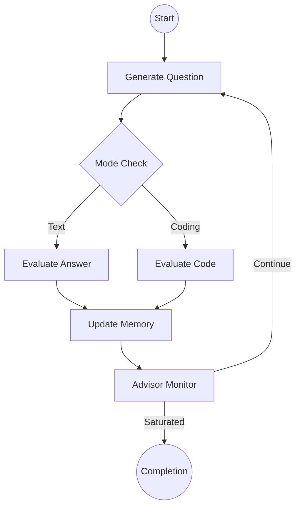
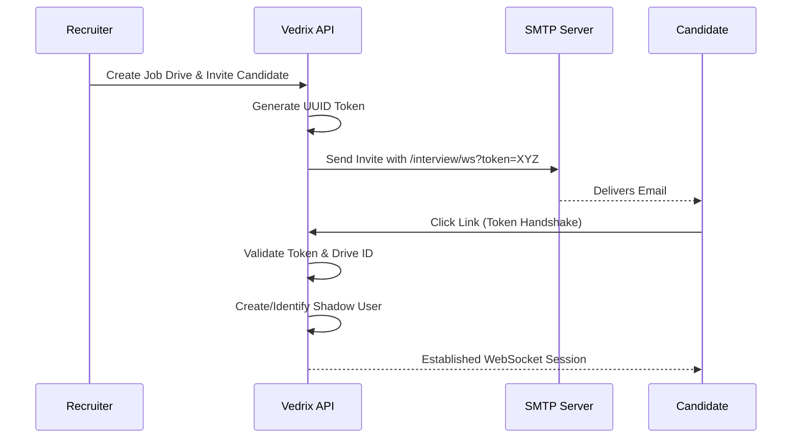
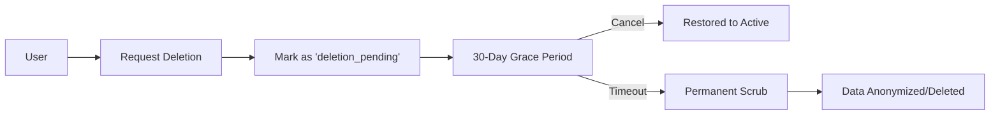

# 🔄 System Workflows & Logic

**Project:** Vedrix AI Interview System  
**Version:** 1.0.0

## 1. Interview Engine Workflow
The interview logic is managed by a stateful graph (LangGraph). The workflow is non-linear and adapts to candidate performance.

### 1.1 Decision Logic (generate_question)
The engine decides the next question using the following priority:
1. **HR Override:** If the recruiter has sent an instruction, follow it immediately.
2. **Phase Completion:** Ensure warmup is done before technical questions.
3. **Skill Gaps:** Prioritize skills listed in the Job Drive that haven't been evidenced yet.
4. **Adaptive Difficulty:** If the previous score was > 8, increase difficulty; if < 4, decrease it.

## 2. Magic Link Authentication Workflow
Candidates can join interviews without an account using secure, one-time tokens.

## 3. Account Deletion Workflow (GDPR)
Ensures compliance while preventing accidental data loss.

## 4. Voice Intelligence Pipeline
Standardizes browser-specific audio for consistent AI transcription.

1. **Capture:** Frontend records raw audio (typically `audio/webm` or `audio/ogg`).
2. **Buffer:** Raw bytes sent over WebSocket.
3. **Normalize:** `VoiceService` uses `pydub` to convert to `MP3 (64k)`.
4. **Transcribe:** `Groq Whisper V3` converts audio to text.
5. **Enrich:** Transcribed text is injected into the LangGraph state for evaluation.
